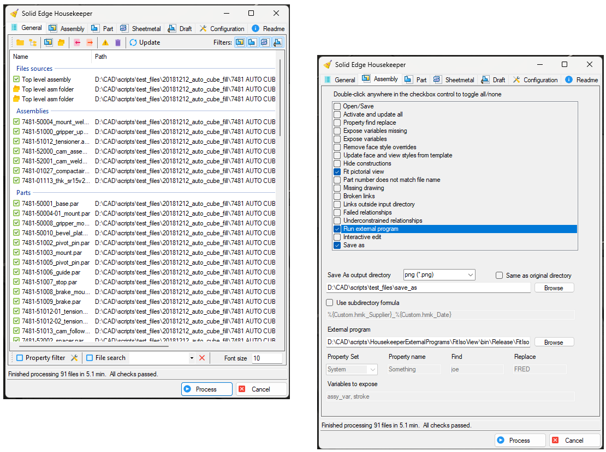
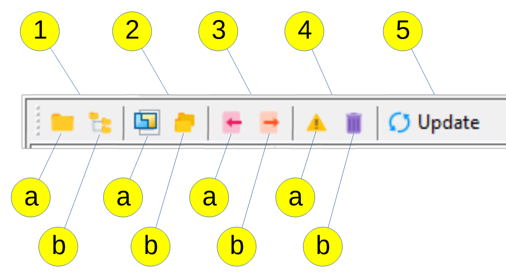

Robert McAnany 2022

**Contributors**:
@farfilli (aka @Fiorini), @daysanduski

**Helpful feedback and bug reports:**
@Satyen, @n0minus38, @wku, @aredderson, @bshand, @TeeVar, @SeanCresswell, @Jean-Louis, @Jan_Bos, @MonkTheOCD_Engie, @[mike miller], @Fiorini, @[Martin Bernhard], @Derek G, @Chris42, @Jason1607436093479, @Bob Henry, @JayJay101

## DESCRIPTION

Solid Edge Housekeeper helps you find annoying little errors in your project. 
It can identify failed features in 3D models, detached dimensions in drawings, 
missing parts in assemblies, and more.  It can also update certain individual 
file settings to match those in a template you specify.

## GETTING HELP

Ask questions or suggest improvements on the [**Solid Edge Forum**](https://community.sw.siemens.com/s/topic/0TO4O000000MihiWAC/solid-edge)

To subscribe to update notices or volunteer to be a beta tester, 
message me, RobertMcAnany, on the forum. 
(Click your profile picture, then 'My Messages', then 'Create'). 
Unsubscribe the same way. 

To combat bots and spam, I will probably ignore requests from 
'User16612341234...'. 
(Change your nickname by clicking your profile picture, then 
'My Profile', then 'Edit'). 

## INSTALLATION

There is no installation per se.  The preferred method is to download or clone 
the project and compile it yourself.

The other option is to use the latest 
[**Release**](https://github.com/rmcanany/SolidEdgeHousekeeper/releases). 
It will be the top entry on the page.  There, click the 
file SolidEdgeHousekeeper-vx.x.x.zip 
(sometimes hidden under the Assets dropdown). 
It should prompt you to save it. 
Choose a convenient location on your machine. 
Extract the zip file (probably by right-clicking and selecting Extract All). 
Double-click the .exe file to run.

If you are upgrading from a previous release, you should be able to copy 
the settings files from the old version to the new. 
The files are 'defaults.txt', 'property_filters.txt', and 'filename_charmap.txt'. 
If you haven't used Property Filter, 'property_filters.txt' won't be there. 
Versions prior to 0.1.10 won't have 'filename_charmap.txt' either.

## SELECTION TOOLBAR

The Selection Toolbar is where you select what files to process. 
You can select by folder, by top-level assembly, by list, or by 
files with errors from a previous run. 
These options are explained below.

### 1. Select by Folder

Choose this option if you want to select files within a single folder, 
or all subfolders.  You can select any number of each.
Referring to the diagram, click the the icon marked **a** to select a single folder, 
click the icon marked **b** to include sub folders.

### 2. Select by Top-Level Assembly

Choose this option if you want to select files contained in an assembly.
Again referring to the diagram, click **a** to choose the assembly, click **b** 
to choose where to look for _where used_ files for the assembly. 
You can select any number of _where used_ folders.

If you don't specify any folders, Housekeeper simply finds
files contained in the specified assembly and subassemblies.

If you do specify one or more folders, there are two options on how to do 
_where used_, **Top Down** or **Bottom Up**.  Make this selection on the
**Configuration Tab**.

#### Top Down

<ol>
    <li>
        Folders
        <ol>
            <li>Folder</li>
            <li>Folder and subfolders</li>
        </ol>
    </li>
    <li>
        Top Level Assembly
        <ol>
            <li>Assembly file</li>
            <li>Folders to search</li>
        </ol>
    </li>
    <li>
        Saved Lists
        <ol>
            <li>Import</li>
            <li>Export</li>
        </ol>
    </li>
    <li>
        File List Operations
        <ol>
            <li>Only show files with errors</li>
            <li>Remove file(s) from list</li>
        </ol>
    </li>
    <li>
        Update List
    </li>
</ol>

## FILTER TOOLBAR

...

# ToyProject
 Getting started with collaboration

## Getting Started

Clone the project and create a new branch.  Make some changes and commit them.  Create a pull request.  The owner will merge the pull request (if he can figure it out).

Markdown created with madskristensen's [**MarkDownEditor**](https://github.com/madskristensen/MarkdownEditor)

